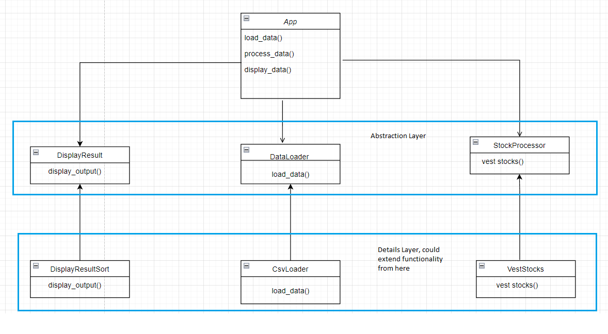

Frontend APP to display Vesting Schedule
===================================

This is a command line application.

Once running, it should looke like below.

.. image:: screenshots.png

Run with Virtual Environment
----------------------------

Below steps are for windows operating system.

1 Create virtual environment:

.. code-block:: bash

   virtualenv venv
   .\venv\Scripts\activate.bat

2 Install requirements:

.. code-block:: bash

    pip install -r requirements.txt

3 To run the application do:

.. code-block:: bash

   python app\vesting_program.py example1.csv 2020-04-01

Application Diagram
-------------------

Future improvment
-----------------
- add unit  testing
- move logging output to central location(it outputs to current folder as of now)
- move to docker

