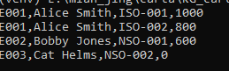

Frontend APP to display Vesting Schedule
===================================

This is a commandline application.

Once running, it should looke like below.

Run with Virtual Environment
----------------------------

Create virtual environment:

.. code-block:: bash

   virtualenv venv
   .\venv\Scripts\activate.bat

Install requirements:

.. code-block:: bash

    pip install -r requirements.txt

To run the application do:

.. code-block:: bash

   python app\vesting_program.py example1.csv 2020-04-01

The output should be something like:

.. code-block::

E001,Alice Smith,ISO-001,1000
E001,Alice Smith,ISO-002,800
E002,Bobby Jones,NSO-001,600
E003,Cat Helms,NSO-002,0
